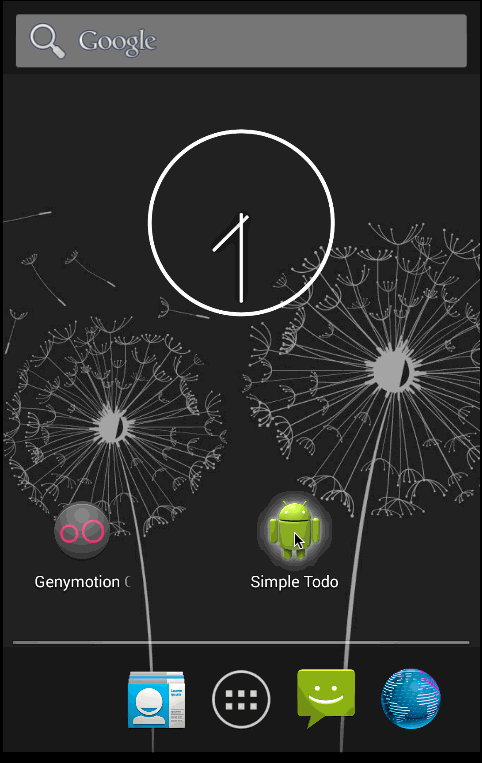

# Simple Android Todo App

This is a simple Android Todo application. The requirements for this app can be found [here](https://gist.github.com/nesquena/843228e83fdc4f5ddc4e).

Time spent: 
MVP - 1.5 hours  
Extended - 8 hours

### Completed user stories:

 * [x] Required: User can add a new todo item
 * [x] Required: User can view a list of existing todo items
 * [x] Required: Items are persisted locally in a file
 * [x] Required: User can edit the text for the todo item by clicking on it in the list view
 * [x] Required: User can delete a todo item by doing a long press on the item in the list view
 * [x] Add ability to complete tasks
 * [x] Add ability to set due dates

### Extended Tasks:

#### Completed:

 * [x] Use sqlite to persist data
 * [x] Use a custom adapter for the list view
 * [x] Make use of view holder pattern to improve performance
 * [x] Use dialog fragment; used it for date picker view
 * [x] Update visuals: Added a card view for to do items, added a background to list view
 
#### Pending:
 
 * [ ] Update visual for when an item is completed
 * [ ] Add proper due date validation
 * [ ] Add checkbox on edit item view
 * [ ] Add support for setting priority
 * [ ] Show priority and date in the list view

 
### Notes:

- Used Android Studio for development
- Used Genymotion emulator as I could not get the regular emulator to work

### Walkthrough of all user stories:
 

 
 
GIF created with [LiceCap](http://www.cockos.com/licecap/). 
Used the app background wallpaper from [this site](http://android.appstorm.net/roundups/customization-roundups/50-beautiful-hd-wallpapers-for-your-android-phone/).
