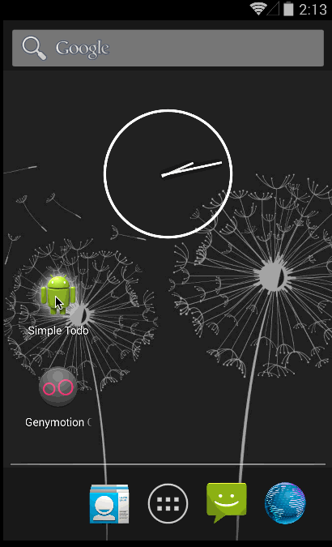

# Simple Android Todo App

This is a simple Android Todo application. The requirements for this app can be found [here](https://gist.github.com/nesquena/843228e83fdc4f5ddc4e).

Time spent: 1.5 hours spent in total

Completed user stories:

 * [x] Required: User can add a new todo item
 * [x] Required: User can view a list of existing todo items
 * [x] Required: Items are persisted locally in a file
 * [x] Required: User can edit the text for the todo item by clicking on it in the list view
 * [x] Required: User can delete a todo item by doing a long press on the item in the list view
 
Notes:

- Used Android Studio for development
- Used Genymotion emulator as I could not get the regular emulator to work

Walkthrough of all user stories:

GIF created with [LiceCap](http://www.cockos.com/licecap/).
